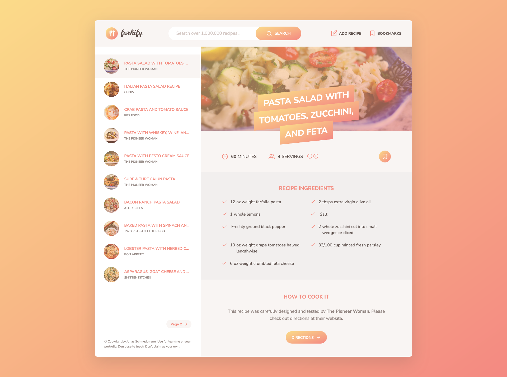

# 🍳 Forkify — Recipe App

This project is a **web application** built during an advanced JavaScript course. It allows users to **search for recipes**, **bookmark their favorites**, **create their own recipes**, and even **adjust servings dynamically** — all powered by a real API.

## 📑 Table of contents

-   [Overview](#overview)
    -   [Screenshot](#screenshot)
    -   [Links](#links)
-   [My process](#my-process)
    -   [Built with](#built-with)
    -   [What I learned](#what-i-learned)
    -   [Continued development](#continued-development)
    -   [Useful resources](#useful-resources)
-   [Author](#author)
-   [Acknowledgments](#acknowledgments)

## 🔍 Overview

### 📸 Screenshot

#### 🧩 App Interface

A preview of the Forkify web application showing recipe search results and a recipe view.

#### 🔄 Flowchart

This diagram outlines the main logic flow of the application — from fetching recipe data to rendering results and managing user interactions.

#### 🧠 MVC Architecture

The project follows the **Model-View-Controller** architecture pattern, which separates business logic, UI, and control flow.

### 🔗 Links

-   Solution URL: [https://github.com/Jair-MV/Forkify](https://github.com/Jair-MV/Forkify)
-   Live Site URL: [https://forkify-jmv-mx.netlify.app/](https://forkify-jmv-mx.netlify.app/)

## 🛠️ My process

### Built with

-   JavaScript (ES6+)
-   ES modules
-   MVC architecture
-   OOP principles
-   Asynchronous JavaScript (Promises, async/await)
-   Fetch API (GET/POST requests)
-   Error handling with `try...catch`
-   [Parcel.js](https://parceljs.org/) — bundler and dev environment
-   JSON manipulation: `.json()`, `.text()`, `JSON.parse()`, `JSON.stringify()`

### 📘 What I learned

The most valuable lesson from this project was **planning**.  
We started by defining **user stories** — the expectations and needs of our users. From there, we created a **feature list**, which shaped the functionality of the app. Then, we designed a **flowchart** to answer _“What needs to be done?”_, followed by an **MVC architecture** that answered _“How will it be done?”_.

Understanding **how data flows through the app** — from one module or method to another — was one of the biggest challenges but also the most enlightening part of the process.

I also grasped the true importance of the **application state** — the single source of truth that keeps the UI and the data perfectly in sync.  
In my view, that’s one of the core responsibilities of a front-end developer: maintaining UI consistency through state management. This concept really connected with me, and it helped me appreciate why frameworks like **React.js** exist — they simplify that synchronization.

Some of the concepts and practices I explored:

-   Implementing the **MVC pattern** to clearly separate concerns:
    -   **Model:** business logic and data handling
    -   **View:** presentation layer and event listeners
    -   **Controller:** the orchestrator that connects model and view
-   Using **classes** to define different views of the app
-   Applying naming conventions like a leading underscore `_` for pseudo-private methods
-   Writing my own logic for handling search results and pagination (I found the instructor’s version confusing and wanted a cleaner approach)
-   Experimenting with how the **Fetch API** handles failed requests — realizing that a missing resource doesn’t automatically throw an error, which deepened my understanding of proper JSON handling

> This project helped me connect the dots between architecture, logic, and user experience — turning abstract concepts into real, tangible code.

### 🚀 Continued development

I plan to continue learning **React.js** to better understand state-driven UIs and component-based architectures.  
Beyond that, I want to explore **backend development**, **databases**, and **server-side logic** to gain a full understanding of the web development ecosystem.

### 📚 Useful resources

-   [MDN Web Docs](https://developer.mozilla.org/) – A go-to reference for documentation, examples, and best practices.

## 👤 Author

-   GitHub - [Jair-MV](https://github.com/Jair-MV)

## 🙌 Acknowledgments

This project was built as part of the **"The Complete JavaScript Course 2025: From Zero to Expert!"** course by [Jonas Schmedtmann](https://www.udemy.com/user/jonasschmedtmann/) on Udemy.  
A big thanks to Jonas for providing such a well-structured and hands-on learning experience!
